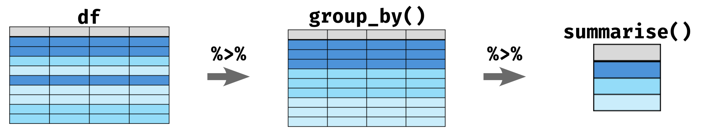

## Session 1のゴール

-   CSVデータを読み込む
-   デモデータを記述統計で確認する
-   デモデータをグラフで可視化する

## RとRStudio

-   **R**：データ解析に特化したプログラミング言語の一つ
-   **RStudio**：Rに特化した統合開発環境（integrated development environment; IDE）

### RStudioの画面

{fig-align="center" width="80%"}

基本的にスクリプトウィンドウで作業します。他の画面は確認に使用することが多く、実際に書き込むことはあまりありません。

### スクリプトウィンドウ（左上）

- **スクリプトファイル**でソースコードを書く場所。
- ここでソースコードを書いたスクリプトファイル (file.R) を保存することで、何度でも解析を実行することができる。
- ソースコードは`Tools → Global Options → Appearance`を設定することで、見た目をわかりやすく表示できるようになる。

{fig-align="center" width="60%"}

::: {.callout-tip}
#### 演習1.1

Rの見た目を自分の好きなものに変更してみよう。

:::

### コンソールウィンドウ（左下）

- 実行結果の表示
- 直接コンソールにソースコードを書くことも可能
- Terminalタブに切り替えることでターミナル操作も可能

### Environmentビュー（右上）

- オブジェクトやデータの格納
- Import DatasetからGUIでのデータ読み込みができる。Import Datasetからの読み込みはSet working directoryの設定を省略できるので便利。
- 使用メモリの確認
- Historyタブから実行コードの確認ができる
- Git管理もここから見れる。バージョン管理までできる人は要チェック

### 汎用ビュー（右下）
- Files: ディレクトリ構成の確認
- Plots: 実行したplotが表示される
- Packages: インストール済みのパッケージの確認とCRANからのインストールができる

## コードの実行

コードの実行方法は２つあります。

1. コンソールでコードを書いて実行
1. スクリプトウィンドウでスクリプトを書いて実行

### コンソールでのコード実行

```{r}
#| lst-label: lst-calc-basic1
#| lst-cap: "計算機 1"
#| eval: false

1 + 1
```

まずは @lst-calc-basic1 をコンソールで直接実行してみましょう。コピペはダメです。
計算できましたか？では次に基本の四則計算をやってみましょう。

```{r}
#| lst-label: lst-calc-basic2
#| lst-cap: "計算機 2"
#| eval: false

5 + 6
18 - 5
3 * 18
10 / 3
10 %/% 3
10 %% 3
```

@lst-calc-basic2 を実行してください。どうでしょうか？割り算は表記法で結果が変わります。基本の計算は解析でもよく使うので（正規化が代表的です）Rでの書き方を知っておきましょう。

### スクリプトの実行

では先ほどのコードをスクリプトに書いてみましょう。スクリプトはメニューバーから`File → New File → R script`、または`⇧⌘N`またはRStudioウィンドウの上部にある白い紙に＋マークのアイコンから開くことができます。

```{r}
#| lst-label: lst-calc-basic3
#| lst-cap: "計算機 3"
#| eval: false

5 + 6   　# 足し算
18 - 5　　# 引き算
3 * 18  　# 掛け算
10 / 3　　# 割り算
10 %/% 3　# 割り算（整数のみ返す）
10 %% 3　 # 割り算（商の余りを返す）
```

Untitledというファイルがスクリプトウィンドウで開いたら、@lst-calc-basic3 を書いてみてください。

では実行してみましょう。実行はスクリプトウィンドウのツールバーのRunアイコンからもできますが、実行したい行にカーソルを置いて`⌘Enter`の方が気軽です。複数行を一気に実行したいときは複数行選択した状態で`⌘Enter`で実行できます。

どうでしょうか？コンソールで実行したときと同じ結果が得られたと思います。また、今回手本コード(@calc-basic3)に書いてある`# コメント`の内容は表示だけされて実行結果には影響を与えなかったはずです。Rに限らずプログラム言語には**コメントアウト機能**が備わっています。そのとき何を考えてそのコードを書いたのか、意外と忘れます。コメントと一緒にスクリプトを書くことでコードの再現性がより高くなります。こまめにコメントアウトをする癖をつけましょう。コメントアウトは`#`を書いてから書き込む方法と選択行を一気にコメントアウトする`⌘⇧C`のどちらかでできます。

::: {.callout-tip}
### 演習1.2

四則計算以外の複雑な計算もやってみよう。下のコードがうまく動いたら、loge20 + sin(3π/2) を計算してみましょう。答えは1.995732になるはずです。

```{r}
#| eval: false
sin(pi / 2)                    # sin(π/2)

cos(pi)                        # cos(π)

log(exp(3))                    # log(e^3) (log(): baseを指定しなければ自然対数)

log(100, base = 10)            # log10(100)

sqrt(3^2 + 4^2)                # √(3^2 + 4^2)

sin(pi / 4)^2 + cos(pi / 4)^2  # sin^2(π/4) + cos^2(π/4)
```

<details>
<summary>答えを見る</summary>

```{r}  
#| echo: false
sin(pi / 2)

cos(pi)

log(exp(3))

log(100, base = 10)  

sqrt(3^2 + 4^2)

sin(pi / 4)^2 + cos(pi / 4)^2
```

</details>
:::

## データの読み込みから学ぶオブジェクト指向

### オブジェクト指向
そろそろRStudioの画面にも慣れてきたでしょうか？ではデータの読み込みをやってみましょう！

データ読み込みの前に知っておくべき知識があります。**オブジェクト指向**です。

::: {.key-message}

**オブジェクト指向(Object-Oriented Programming, OOP)**

オブジェクト： Rの環境に記憶させた「何か」

ベクトル、行列、データフレーム全てがオブジェクトとしてRの環境に記憶され、各オブジェクトには**固有の名前**が存在する。

:::

```{r}
#| lst-label: lst-object-basic1
#| lst-cap: "OOP 1"
#| eval: false

c(3, 4, 7, 10, 30) # c() = ベクトル（値を並べたもの）
mean(c(3, 4, 7, 10, 30))
sd(c(3, 4, 7, 10, 30))
```

では、オブジェクトに何かを格納してみましょう。まずは @lst-object-basic1 を実行してください。（ここからは全てスクリプトで作業しましょう！）
同じデータを何回も書いています。面倒この上ないし、いつかデータを開き間違えることでしょう。では次にオブジェクトを使って同じことをします。

```{r}
#| lst-label: lst-object-basic2
#| lst-cap: "OOP 2"
#| eval: false

data1 <- c(3, 4, 7, 10, 30)
data1

mean(data1)
sd(data1)
```

@lst-object-basic2 を実行してみましょう。 @lst-object-basic1 と同じ結果なのに書く労力が段違いですね！これがオブジェクト指向の考え方です。

このように`オブジェクト名 <- 何か`という動作を「オブジェクトに「何か」を格納する」と言います。今回の例だとnumberというオブジェクトにベクトルでデータを格納したということになります。オブジェクトに格納すると、 @lst-object-basic2  のようにオブジェクト名だけで実行すると、中身を表示させることができます。

また、今回平均値を計算するmean()と不偏標準偏差を計算するsd()の二つの関数を使いました。 @lst-object-basic1 のようにデータそのものを渡すこともできますが、オブジェクトを渡す方が楽かつ今後データが変わった時に1行しか書き換えなくて済むと言う利点があります。


### データの読み込みとtidyverseパッケージ

ではデータを読み込む前に、データ解析の強力な味方である「tidyverseパッケージ」をインストールしましょう。

Rはプログラミング言語であり、基本的な機能は備わっていますが、実際のデータ解析ではさまざまな追加機能を使うことが一般的です。この追加機能のまとまりを**「パッケージ」**と呼びます。イメージはRがSwitchの本体、パッケージがMonster Hunter riseソフト、関数がハンターのアクションやモンスターの動きという感じです。

中でもtidyverseは、データの読み込み・加工・可視化を一貫して行うためのパッケージ群です。tidyverseパッケージの中にさらにtibble、ggplot2、readrなどのパッケージが格納されています。

```{r}
#| label: read-data1
#| fig-cap: "コード7：tidyverseのインストール"
#| echo: true
#| eval: false

install.packages("tidyverse") # パッケージのインストール（初回のみ）
library(tidyverse) # インストール済パッケージの読み込み

```

インストールできたでしょうか？library()はRを開くたびに実行してください。インストールはソフトの購入、library()はソフトの起動にあたります。購入は（普通は）一回でいいですが、起動はゲームを始めるたびに必要ですね？Rも同じくです。

では、tidyverseのtibbleパッケージのtibble関数を使って簡単なデータを作り、オブジェクト指向の素晴らしさを実感してみましょう。

```{r}
#| lst-label: lst-read-data2
#| lst-cap: "データフレームの生成"
#| echo: true
#| message: false

library(tidyverse) # パッケージの読み込み

# データを作る
## tibble(列名A = ベクトルA, 列名B = ベクトルB)
df <- tibble(
  ID       = c(1, 2, 3, 4, 5, 6),
  genotype = c("WT", "WT", "WT", "KO", "KO", "KO"),
  motility = c(85, 90, 90, 50, 95, 90)
)

df
```

@lst-read-data2 を実行してください。tibbleは表作成の関数です。実行すると上のようにgenotypeとmotilityという二つの列にそれぞれ指定した値が入った表が作成されたと思います。`tibble()`の構文はエクセルの各列に数字を書き込むのと変わりありません。

生成された表をよくみてみましょう。ID、genotype、motilityの三つの列ができましたね？このような表を**データフレーム**と呼びます。データフレームはRで最もよく使われるデータ構造の一つで、行と列からなる表形式のデータを格納するためのオブジェクトです。データフレームは、異なる型のデータを同時に格納できるため、非常に柔軟なデータ構造です。

`tidyverse`に属す関数で読み込むとデータ型(data type)を自動で判断してくれるというメリットもあります。データ型というのは、データがどのような種類であるかを示すものです。例えば、上のコードでIDは数値型、genotypeは文字列型、motilityは数値型と自動で判断されていることがわかります。データフレームを作成する際に、列ごとに異なるデータ型を指定することもできますが、`tidyverse`の関数を使用すると、データ型の自動判断が行われるため、手動で指定する必要がなくなります。

データ型は、データ解析において非常に重要です。特に量的データか質的データかの区別は、どんな統計を適用できるかと言う判断に大きく影響します。`tidyverse`をお勧めするのはこの判断が楽に行えるからです。

:::{.callout-tip}
### 演習1.3
下の表を作ってみよう。

```{r}
#| lst-label: lst-read-data2
#| lst-cap: "データフレームの生成"
#| echo: false 

library(tibble)

tibble(
  ID = seq(1, 5, 1),
  location = c("Ueda", "Nagano", "Matsumoto", "Ueda", "Tomi"),
  num_species = c(118, 150, 90, 81, 221)
)
```
:::

データフレームの構造は理解できましたか？では次にCSVファイルからデータを読み込んでみましょう。デモデータを用意したのでしたからダウンロードしてください。DesktopにR_course/inputsというフォルダを作り、その中にダウンロードしたデータを入れましょう。

[デモデータをダウンロード](demo_dataset/code_csvdata_readr.csv)

:::{.callout-tip}
パス（フォルダやファイルの場所）の書き方

`Desktop/R_course/inputs/code_csvdata_readr.csv`

という風に書くとDesktopにあるR_courseというフォルダの中のinputsフォルダにあるcode_csvdata_readr.csvファイルを示すことになります。フォルダの中にさらにフォルダがある場合、`/`でつなぎます。ファイル名を指定する場合は拡張子まで書かないとエラーになります。
:::

```{r}
#| lst-label: lst-read-data3
#| lst-cap: "CSVファイルからのデータ読み込み"
#| echo: true
#| eval: false
#| message: false 

library(readr)

# データの読み込み dfはオブジェクト名、read_csv("ファイルパス")
df <- read_csv("demo_dataset/code_csvdata_readr.csv")

# データの簡単な確認 glimpse(オブジェクト名)
glimpse(df)

```

次に上のコードを実行してください。パスは自身のパスに置き換えましょう。File viewでデータのあるフォルダを開き、`⚙️ More → Copy Folder Path to Clipboard`でパスのコピーもできます。`glimpse()`を使いましたが、データの確認はいろいろな関数があります。先ほど使った`tibble(df)`でも確認ができるでしょう。`head(df)`もよく使います。それぞれ実行してみてください。

read_csv()はreadrパッケージの関数でcsvをデータフレームとして読み込んでくれます。他にもread_tsv()などいろいろな拡張子に対応します。エクセルファイル(.xlsx)の読み込みはreadrパッケージでは不可能です。readxlパッケージが必要になります。ただシートの指定などが必要になる上、エラーもよく起こるので、この講座では一貫してcsvを扱います。

## 記述統計量の計算
では、早速読み込んだデータの記述統計をやってみましょう。まずは、代表的な量的データ、平均値、中央値、最小値、最大値、四分位数を計算してみましょう。

```{r}
#| lst-label: lst-descriptive1
#| lst-cap: "記述統計 1"
#| echo: true
#| eval: false

library(readr)

# データの読み込み
df <- read_csv("demo_dataset/code_csvdata_readr.csv")

# データの中身をよく確認する
# どんな列があるか
names(df)

# どんなマウスがいるか、どんな遺伝子型があるかを確認したい
df %>% count(public_group, genotype_label)

summary(df)
```

記述統計でよくRの教科書に登場するのは、`summary()`ですが、これは正直そのまま使えません。

上の手本コードはその代表例です。`df %>% count(public_group, genotype_label)`の結果は以下のように出力されますが、この通り、このデータでは４群の比較になるはずです。summary()は全体の平均値や中央値を出すだけなので、群ごとの記述統計を出すことができません。

```{r}
#| echo: false
#| eval: true
#| message: false
#| warning: false

library(readr)

# データの読み込み
df <- read_csv("demo_dataset/code_csvdata_readr.csv")

df %>% count(public_group, genotype_label)

```

では群ごとの記述統計を出すにはどうすればいいでしょうか？次のコードを実行してみてください。

```{r}
#| echo: true
#| eval: false
#| message: false
#| warning: false

# グループごとの平均値の計算
df_summary <- df %>% 
  group_by(public_group) %>%
  summarise(
    n = n(),
    body_weight_g_mean = mean(body_weight_g, na.rm = TRUE),
    testis_weight_L_mg_mean = mean(testis_weight_L_mg, na.rm = TRUE)
  )

# 表示
df_summary

```

どうでしょうか？`group_by()`で指定した列の値ごとにデータをグループ化して、`summarise()`で指定した列の平均値を計算してくれました。このような層別解析を行うときに、欠かせない演算子が`%>%`です。これは**パイプ演算子**と呼ばれ、左側のオブジェクトを右側の関数の最初の引数として渡すことができます。図を参考に説明すると、dfをgroup_by()に渡して、層別化されたデータをsummarise()に渡して、平均値を計算してくれるというイメージです。パイプ演算子を使わない場合以下のようなコードになります。

{fig-align="center" width="80%"}

```{r}
#| echo: true
#| eval: false
#| message: false
#| warning: false

# グループごとの平均値の計算
# na.rm = TRUEはNAを無視して平均値を計算するための引数
# na.rmを指定しない場合、1行でもNAがあると計算結果がNAになる
df_grouped <- group_by(df, public_group)

df_summary <- summarise(df_grouped,
    n = n(),
    body_weight_g_mean = mean(body_weight_g, na.rm = TRUE),
    testis_weight_L_mg_mean = mean(testis_weight_L_mg, na.rm = TRUE)
  )

# 表示
df_summary

```

解析で使わない`df_grouped`というオブジェクトができてしまいますね？このようにパイプ演算子はよりシンプルにコードを書くことができるので、ぜひ覚えてください。

:::{.callout-tip}
### 演習1.4

グループごとの中央値、最小値、最大値、四分位数も計算してみよう。`summarise()`の中に計算したい統計量を追加するだけでできる。

**記述統計量　関数チートシート**

| 指標 | 関数 | 説明 |
|------|------|------|
| サンプル数 | `n()` | データ数 |
| 平均 | `mean(x, na.rm = TRUE)` | データの中心 |
| 中央値 | `median(x, na.rm = TRUE)` | 真ん中の値 |
| 最小値 | `min(x, na.rm = TRUE)` | 一番小さい値 |
| 最大値 | `max(x, na.rm = TRUE)` | 一番大きい値 |
| 第1四分位 | `quantile(x, 0.25, na.rm = TRUE)` | 下位25% |
| 第3四分位 | `quantile(x, 0.75, na.rm = TRUE)` | 上位25% |
| 標準偏差 | `sd(x, na.rm = TRUE)` | ばらつき |
| 標準誤差 | `sd(x, na.rm = TRUE) / sqrt(n)` | 平均の誤差 |
:::

## データの可視化

では、最後にデータの可視化をやってみましょう。データの可視化に特化したパッケージが`ggplot2`です。`ggplot2`は非常に強力なパッケージで、直感的に美しいグラフ作成ができます。ではまず基本のグラフを作ってみましょう。

```{r}
#| lst-label: lst-visualization1
#| lst-cap: "データの可視化 1"
#| echo: true
#| eval: true
#| message: false
#| warning: false

ggplot(df, aes(x = public_group, y = body_weight_g, fill = public_group)) +
  geom_boxplot(outlier.shape = NA) +
  geom_jitter(aes(colour = public_group), width = 0.2, alpha = 0.7) +
  theme_classic()


```

@lst-visualization1 を実行しましょう。手本コードではすべて書いてしまっていますが、実行時、`+`の前で一つずつ実行してみましょう。グラフがどのように変化するかを確認してみてください。以下のように、グラフが段階的に完成していくはずです。ちなみに、`ggplot(df, aes(x = public_group, y = body_weight_g, fill = public_group))`の部分はグラフの土台を作る（データフレームの指定とx軸、y軸の指定）だけなので、ここの実行だけでは何も表示されません。geom系の関数を追加することで、グラフが作られます。

```{r}
#| lst-label: lst-visualization1
#| lst-cap: "データの可視化 1"
#| echo: false
#| eval: true
#| warning: false

library(patchwork)

p1 <- ggplot(df, aes(x = public_group, y = body_weight_g, fill = public_group)) +
  geom_boxplot(outlier.shape = NA) +
  theme(axis.text.x = element_text(angle = 30, hjust = 1),
        plot.margin = margin(b = 20)) +
  guides(fill = "none")
  
p2 <- ggplot(df, aes(x = public_group, y = body_weight_g, fill = public_group)) +
  geom_boxplot(outlier.shape = NA) +
  geom_jitter(aes(colour = public_group), width = 0.2, alpha = 0.7) +
  theme(axis.text.x = element_text(angle = 30, hjust = 1),
        plot.margin = margin(b = 20)) +
  guides(fill = "none", colour = "none")

p3 <- ggplot(df, aes(x = public_group, y = body_weight_g, fill = public_group)) +
  geom_boxplot(outlier.shape = NA) +
  geom_jitter(aes(colour = public_group), width = 0.2, alpha = 0.7) +
  theme_classic() +
  theme(axis.text.x = element_text(angle = 30, hjust = 1),
        plot.margin = margin(b = 20)) +
  guides(fill = "none")

p1 <- p1 + ggtitle("1. only boxplot")
p2 <- p2 + ggtitle("2. add jitter")
p3 <- p3 + ggtitle("3. add theme")

(p1 | p2 | p3) +
  plot_layout(guides = "collect") &
  theme(legend.position = "bottom")
```

ggplot2は主に以下の３つの要素から構成されます。

1. ggplot(df, aes(x = ~, y = ~, fill = ~))：グラフの土台(fillやcolourで群ごとの色分けを指定)
1. geom系の関数：グラフの種類を指定
1. theme系の関数：グラフの見た目を指定

チートシートを用意したので、グラフの種類や見た目を変えてみましょう。

:::{.callout-tip}
### 演習1.5

@lst-visualization1 で作ったグラフの種類・見た目を変えてみよう。

**ggplot2の関数チートシート**

| 分類 | 関数 / 要素 | 用途 |
|------|-------------|------|
| geom | `geom_point()` | 散布図・点を描く |
| geom | `geom_jitter()` | 点を少しずらして重なりを見やすくする |
| geom | `geom_line()` | 折れ線グラフを描く |
| geom | `geom_col()` | 値の高さをそのまま棒グラフにする |
| geom | `geom_bar()` | 件数を自動で数えて棒グラフにする |
| geom | `geom_boxplot()` | 箱ひげ図を描く |
| geom | `geom_violin()` | 分布の形を左右対称で描く |
| geom | `geom_histogram()` | ヒストグラムを描く |
| geom | `geom_density()` | 密度曲線を描く |
| geom | `geom_errorbar()` | エラーバーを描く |
| geom | `geom_text()` | 文字を図中に置く |
| geom | `geom_smooth()` | 回帰線・平滑化曲線を描く |
| theme | `theme_classic()` | 軸だけ残したシンプルなテーマ |
| theme | `theme_bw()` | 白背景＋枠ありのテーマ |
| theme | `theme_minimal()` | 余計な線を減らした軽いテーマ |
| theme | `theme()` | 個別要素を細かく調整する |
| theme要素 | `axis.text.x` | x軸ラベルの文字設定 |
| theme要素 | `axis.text.y` | y軸ラベルの文字設定 |
| theme要素 | `axis.title.x` | x軸タイトルの設定 |
| theme要素 | `axis.title.y` | y軸タイトルの設定 |
| theme要素 | `plot.title` | 図タイトルの設定 |
| theme要素 | `legend.position` | 凡例の位置を変える |
| theme要素 | `legend.title` | 凡例タイトルの設定 |
| theme要素 | `legend.text` | 凡例ラベル文字の設定 |
| theme要素 | `plot.margin` | 図全体の余白調整 |
| theme要素 | `panel.grid.major` | 主グリッド線の設定 |
| theme要素 | `panel.grid.minor` | 補助グリッド線の設定 |
| theme要素 | `panel.border` | 枠線の設定 |
| theme要素 | `strip.text` | facet見出しの設定 |
| theme要素 | `strip.background` | facet見出し背景の設定 |

* geom系の関数はそれぞれ挙動が違うので、渡すべき引数の種類を確認してから使いましょう。例えば、geom_colはy軸に統計量を渡す必要がありますが、geom_boxは個別データを渡す必要があります。
* theme()の中で個別要素を指定する場合、`要素 = element_関数()`の形で書きます。例えば、`axis.text.x = element_text(angle = 30, hjust = 1)`はx軸のラベルを30度傾けて、右寄せにするという意味になります。
::: 

正直、これらの関数をすべて覚える必要はありません。グラフの種類や見た目を変えたいときに、チートシートをみたり、AIに聞いたりして、必要な関数を調べられればOKです。いろいろなグラフを作ってみてください。下に演習1.5の参考例を載せておきます。模写しながらggplot2の構造を理解してみてください。

<details>
<summary>演習1.5の例</summary>

```{r}  
#| echo: true
#| eval: true
#| warning: false
#| message: false

# violin plot
ggplot(df, aes(x = public_group, y = body_weight_g, fill = public_group)) +
  geom_violin(alpha = 0.6, trim = FALSE) +
  geom_jitter(aes(colour = public_group), width = 0.15, alpha = 0.7) +
  theme_classic()

# jitter plot
ggplot(df, aes(x = public_group, y = body_weight_g, colour = public_group)) +
  geom_jitter(width = 0.15, size = 2.5, alpha = 0.8) +
  theme_classic()

# bar plot (mean ± standard error)
df_summary <- df %>%
  group_by(public_group) %>%
  summarise(
    n = n(),
    mean_bw = mean(body_weight_g, na.rm = TRUE),
    sd_bw = sd(body_weight_g, na.rm = TRUE),
    se_bw = sd_bw / sqrt(n)
  )

ggplot(df_summary, aes(x = public_group, y = mean_bw, fill = public_group)) +
  geom_col(width = 0.7) +
  geom_errorbar(aes(ymin = mean_bw - se_bw, ymax = mean_bw + se_bw), width = 0.2) +
  theme_classic()

# jitter plot ＋ 平均値
ggplot(df, aes(x = public_group, y = body_weight_g, colour = public_group)) +
  geom_jitter(width = 0.15, alpha = 0.7) +
  stat_summary(fun = mean, geom = "point", size = 4, colour = "black") +
  theme_classic()

# histogram
ggplot(df, aes(x = body_weight_g, fill = public_group)) +
  geom_histogram(bins = 10, alpha = 0.8) +
  facet_wrap(~ public_group, scales = "free_y") +
  theme_classic()

# scatter plot
ggplot(df, aes(x = body_weight_g, y = testis_weight_L_mg, colour = public_group)) +
  geom_point(size = 2.5, alpha = 0.8) +
  theme_classic()

ggplot(df, aes(x = body_weight_g, y = testis_weight_L_mg)) +
  geom_point(size = 2.5, alpha = 0.8, colour = "steelblue") +
  geom_smooth(method = "lm", se = FALSE, colour = "black") +
  facet_wrap(~ public_group) +
  theme_classic()

ggplot(df, aes(x = age_weeks_at_sampling, y = body_weight_g, colour = public_group)) +
  geom_point(size = 2.5, alpha = 0.8) +
  geom_smooth(se = FALSE) +
  theme_classic()
```

</details>