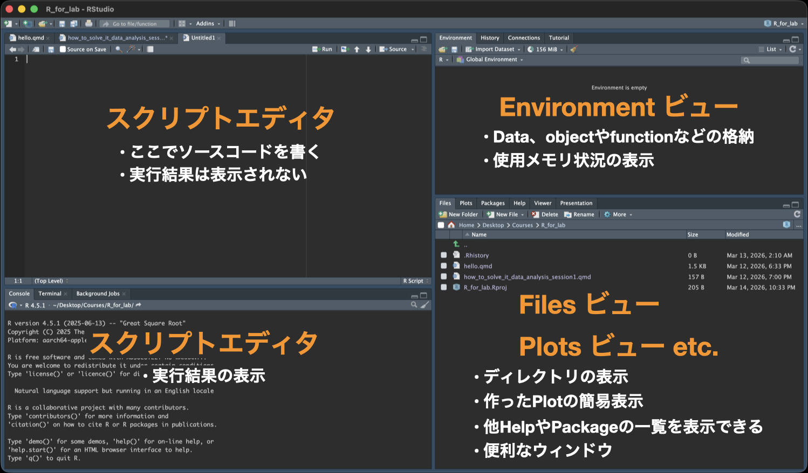
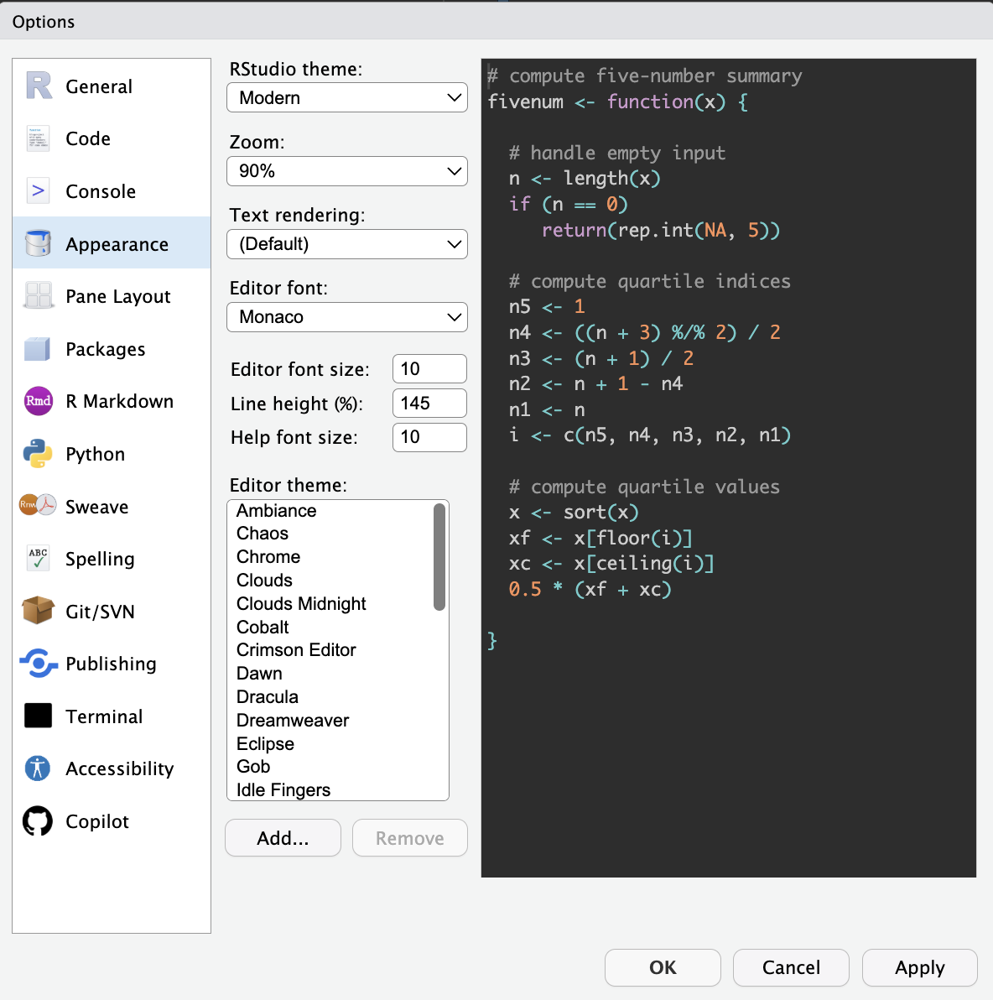

## Session 1のゴール

-   CSVデータを読み込む
-   デモデータを記述統計で確認する
-   デモデータをグラフで可視化する

## RとRStudio

-   **R**：データ解析に特化したプログラミング言語の一つ
-   **RStudio**：Rに特化した統合開発環境（integrated development environment; IDE）

### RStudioの画面

{fig-align="center" width="80%"}

基本的にスクリプトウィンドウで作業します。他の画面は確認に使用することが多く、実際に書き込むことはあまりありません。

### スクリプトウィンドウ（左上）

- **スクリプトファイル**でソースコードを書く場所。
- ここでソースコードを書いたスクリプトファイル (file.R) を保存することで、何度でも解析を実行することができる。
- ソースコードは`Tools → Global Options → Appearance`を設定することで、見た目をわかりやすく表示できるようになる。

{fig-align="center" width="60%"}

::: {.callout-tip}
#### 演習1.1

Rの見た目を自分の好きなものに変更してみよう。

:::

### コンソールウィンドウ（左下）

- 実行結果の表示
- 直接コンソールにソースコードを書くことも可能
- Terminalタブに切り替えることでターミナル操作も可能

### Environmentビュー（右上）

- オブジェクトやデータの格納
- Import DatasetからGUIでのデータ読み込みができる。Import Datasetからの読み込みはSet working directoryの設定を省略できるので便利。
- 使用メモリの確認
- Historyタブから実行コードの確認ができる
- Git管理もここから見れる。バージョン管理までできる人は要チェック

### 汎用ビュー（右下）
- Files: ディレクトリ構成の確認
- Plots: 実行したplotが表示される
- Packages: インストール済みのパッケージの確認とCRANからのインストールができる

## コードの実行

コードの実行方法は２つあります。

1. コンソールでコードを書いて実行
1. スクリプトウィンドウでスクリプトを書いて実行

### コンソールでのコード実行

```{r}
#| lst-label: lst-calc-basic1
#| lst-cap: "計算機 1"
#| eval: false

1 + 1
```

まずは @lst-calc-basic1 をコンソールで直接実行してみましょう。コピペはダメです。
計算できましたか？では次に基本の四則計算をやってみましょう。

```{r}
#| lst-label: lst-calc-basic2
#| lst-cap: "計算機 2"
#| eval: false

5 + 6
18 - 5
3 * 18
10 / 3
10 %/% 3
10 %% 3
```

@lst-calc-basic2 を実行してください。どうでしょうか？割り算は表記法で結果が変わります。基本の計算は解析でもよく使うので（正規化が代表的です）Rでの書き方を知っておきましょう。

### スクリプトの実行

では先ほどのコードをスクリプトに書いてみましょう。スクリプトはメニューバーから`File → New File → R script`、または`⇧⌘N`またはRStudioウィンドウの上部にある白い紙に＋マークのアイコンから開くことができます。

```{r}
#| lst-label: lst-calc-basic3
#| lst-cap: "計算機 3"
#| eval: false

5 + 6   　# 足し算
18 - 5　　# 引き算
3 * 18  　# 掛け算
10 / 3　　# 割り算
10 %/% 3　# 割り算（整数のみ返す）
10 %% 3　 # 割り算（商の余りを返す）
```

Untitledというファイルがスクリプトウィンドウで開いたら、@lst-calc-basic3 を書いてみてください。

では実行してみましょう。実行はスクリプトウィンドウのツールバーのRunアイコンからもできますが、実行したい行にカーソルを置いて`⌘Enter`の方が気軽です。複数行を一気に実行したいときは複数行選択した状態で`⌘Enter`で実行できます。

どうでしょうか？コンソールで実行したときと同じ結果が得られたと思います。また、今回手本コード(@calc-basic3)に書いてある`# コメント`の内容は表示だけされて実行結果には影響を与えなかったはずです。Rに限らずプログラム言語には**コメントアウト機能**が備わっています。そのとき何を考えてそのコードを書いたのか、意外と忘れます。コメントと一緒にスクリプトを書くことでコードの再現性がより高くなります。こまめにコメントアウトをする癖をつけましょう。コメントアウトは`#`を書いてから書き込む方法と選択行を一気にコメントアウトする`⌘⇧C`のどちらかでできます。

::: {.callout-tip}
### 演習1.2

四則計算以外の複雑な計算もやってみよう。下のコードがうまく動いたら、loge20 + sin(3π/2) を計算してみましょう。答えは1.995732になるはずです。

```{r}
#| eval: false
sin(pi / 2)                    # sin(π/2)

cos(pi)                        # cos(π)

log(exp(3))                    # log(e^3) (log(): baseを指定しなければ自然対数)

log(100, base = 10)            # log10(100)

sqrt(3^2 + 4^2)                # √(3^2 + 4^2)

sin(pi / 4)^2 + cos(pi / 4)^2  # sin^2(π/4) + cos^2(π/4)
```

<details>
<summary>答えを見る</summary>

```{r}  
#| echo: false
sin(pi / 2)

cos(pi)

log(exp(3))

log(100, base = 10)  

sqrt(3^2 + 4^2)

sin(pi / 4)^2 + cos(pi / 4)^2
```

</details>
:::

## データの読み込みから学ぶオブジェクト指向

### オブジェクト指向
そろそろRStudioの画面にも慣れてきたでしょうか？ではデータの読み込みをやってみましょう！

データ読み込みの前に知っておくべき知識があります。**オブジェクト指向**です。

::: {.key-message}

**オブジェクト指向(Object-Oriented Programming, OOP)**

オブジェクト： Rの環境に記憶させた「何か」

ベクトル、行列、データフレーム全てがオブジェクトとしてRの環境に記憶され、各オブジェクトには**固有の名前**が存在する。

:::

```{r}
#| lst-label: lst-object-basic1
#| lst-cap: "OOP 1"
#| eval: false

c(3, 4, 7, 10, 30) # c() = ベクトル（値を並べたもの）
mean(3, 4, 7, 10, 30)
sd(3, 4, 7, 10, 30)
```

では、オブジェクトに何かを格納してみましょう。まずは @lst-object-basic1 を実行してください。（ここからは全てスクリプトで作業しましょう！）
同じデータを何回も書いています。面倒この上ないし、いつかデータを開き間違えることでしょう。では次にオブジェクトを使って同じことをします。

```{r}
#| lst-label: lst-object-basic2
#| lst-cap: "OOP 2"
#| eval: false

data1 <- c(3, 4, 7, 10, 30)
data1

mean(data1)
sd(data1)
```

@lst-object-basic2 を実行してみましょう。 @lst-object-basic1 と同じ結果なのに書く労力が段違いですね！これがオブジェクト指向の考え方です。

このように`オブジェクト名 <- 何か`という動作を「オブジェクトに「何か」を格納する」と言います。今回の例だとnumberというオブジェクトにベクトルでデータを格納したということになります。オブジェクトに格納すると、 @lst-object-basic2  のようにオブジェクト名だけで実行すると、中身を表示させることができます。

また、今回平均値を計算するmean()と不偏標準偏差を計算するsd()の二つの関数を使いました。 @lst-object-basic1 のようにデータそのものを渡すこともできますが、オブジェクトを渡す方が楽かつ今後データが変わった時に1行しか書き換えなくて済むと言う利点があります。


### データの読み込みとtidyverseパッケージ

ではデータを読み込む前に、データ解析の強力な味方である「tidyverseパッケージ」をインストールしましょう。

Rはプログラミング言語であり、基本的な機能は備わっていますが、実際のデータ解析ではさまざまな追加機能を使うことが一般的です。この追加機能のまとまりを**「パッケージ」**と呼びます。イメージはRがSwitchの本体、パッケージがMonster Hunter riseソフト、関数がハンターのアクションやモンスターの動きという感じです。

中でもtidyverseは、データの読み込み・加工・可視化を一貫して行うためのパッケージ群です。tidyverseパッケージの中にさらにtibble、ggplot2、readrなどのパッケージが格納されています。

```{r}
#| label: read-data1
#| fig-cap: "コード7：tidyverseのインストール"
#| echo: true
#| eval: false

install.packages("tidyverse") # パッケージのインストール（初回のみ）
library(tidyverse) # インストール済パッケージの読み込み

```

インストールできたでしょうか？library()はRを開くたびに実行してください。インストールはソフトの購入、library()はソフトの起動にあたります。購入は（普通は）一回でいいですが、起動はゲームを始めるたびに必要ですね？Rも同じくです。

では、tidyverseのtibbleパッケージのtibble関数を使って簡単なデータを作り、オブジェクト指向の素晴らしさを実感してみましょう。

```{r}
#| lst-label: lst-read-data2
#| lst-cap: "データフレームの生成"
#| echo: true
#| message: false

library(tidyverse) # パッケージの読み込み

# データを作る
## tibble(列名A = ベクトルA, 列名B = ベクトルB)
df <- tibble(
  ID       = c(1, 2, 3, 4, 5, 6),
  genotype = c("WT", "WT", "WT", "KO", "KO", "KO"),
  motility = c(85, 90, 90, 50, 95, 90)
)

df
```

@lst-read-data2 を実行してください。tibbleは表作成の関数です。実行すると上のようにgenotypeとmotilityという二つの列にそれぞれ指定した値が入った表が作成されたと思います。`tibble()`の構文はエクセルの各列に数字を書き込むのと変わりありません。

生成された表をよくみてみましょう。ID、genotype、motilityの三つの列ができましたね？このような表を**データフレーム**と呼びます。データフレームはRで最もよく使われるデータ構造の一つで、行と列からなる表形式のデータを格納するためのオブジェクトです。データフレームは、異なる型のデータを同時に格納できるため、非常に柔軟なデータ構造です。

`tidyverse`に属す関数で読み込むとデータ型(data type)を自動で判断してくれるというメリットもあります。データ型というのは、データがどのような種類であるかを示すものです。例えば、上のコードでIDは数値型、genotypeは文字列型、motilityは数値型と自動で判断されていることがわかります。データフレームを作成する際に、列ごとに異なるデータ型を指定することもできますが、`tidyverse`の関数を使用すると、データ型の自動判断が行われるため、手動で指定する必要がなくなります。

データ型は、データ解析において非常に重要です。特に量的データか質的データかの区別は、どんな統計を適用できるかと言う判断に大きく影響します。`tidyverse`をお勧めするのはこの判断が楽に行えるからです。

:::{.callout-tip}
下の表を作ってみよう。

```{r}
#| lst-label: lst-read-data2
#| lst-cap: "データフレームの生成"
#| echo: false 

library(tibble)

tibble(
  ID = seq(1, 5, 1),
  location = c("Ueda", "Nagano", "Matsumoto", "Ueda", "Tomi"),
  num_species = c(118, 150, 90, 81, 221)
)
```
:::

データフレームの構造は理解できましたか？では次にCSVファイルからデータを読み込んでみましょう。


